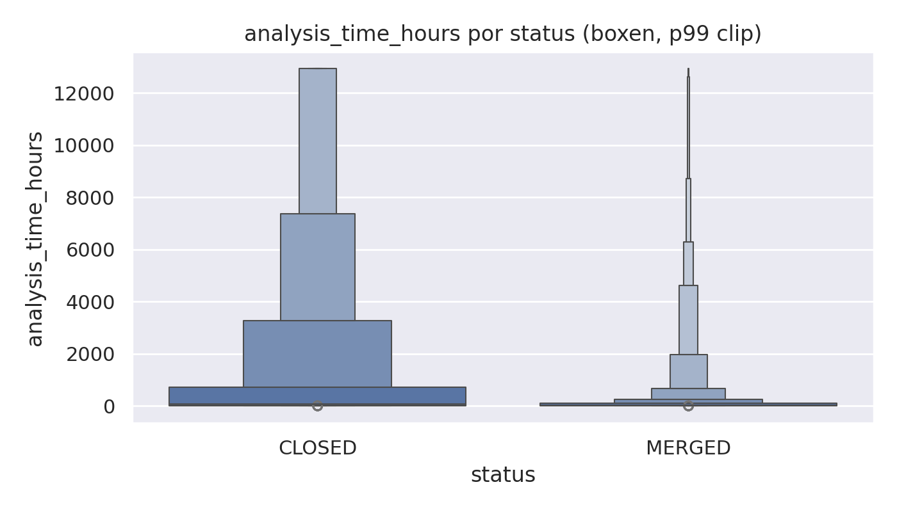
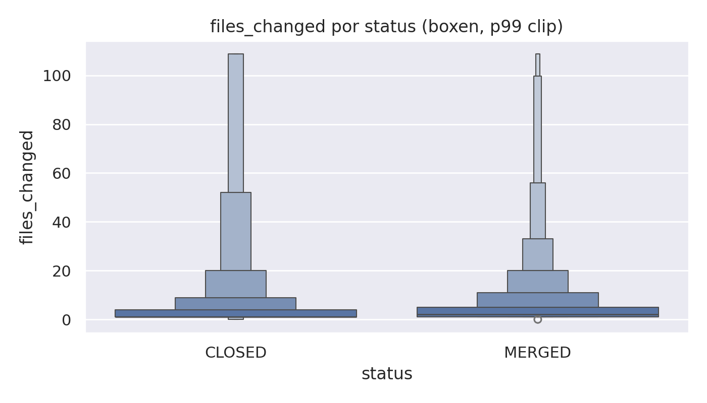
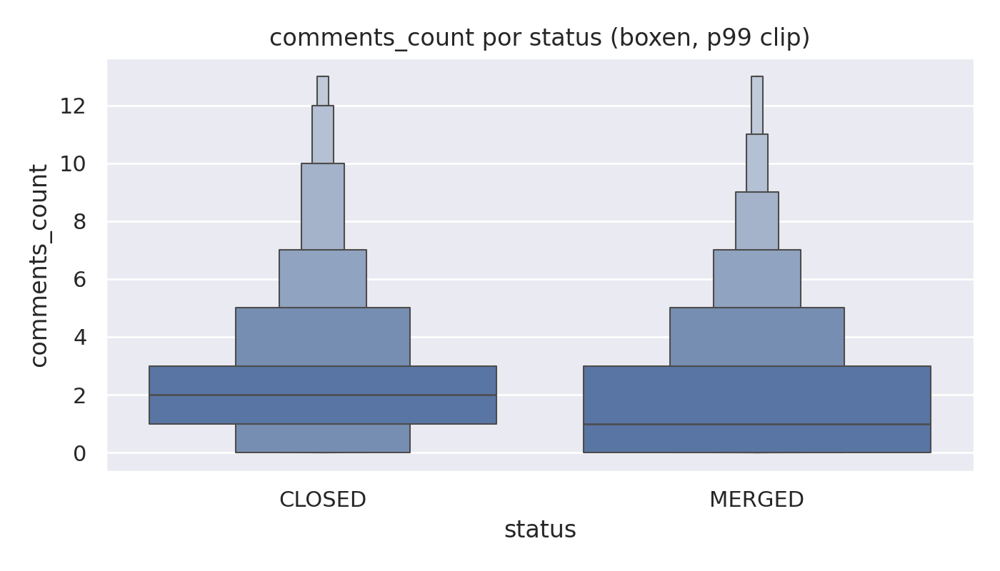

# Lab03 — Caracterizando a atividade de code review no GitHub

## Análise de correlação entre métricas de Pull Requests e resultados do code review

Engenharia de Software — Laboratório 03 — 2026

Thiago Borges Laass & Julia Medeiros

## Sumário

1. Introdução
2. Metodologia
3. Resultados
4. Discussão dos resultados
5. Conclusão

## 1. Introdução

### Contextualização

A prática de code review é central no desenvolvimento de software open source. No GitHub, ela se materializa através de Pull Requests (PRs): um desenvolvedor submete código, revisores avaliam e o PR é aceito (MERGED) ou rejeitado (CLOSED). Entender quais fatores se associam a esse resultado, e ao número de revisões acumuladas por um PR, é o objetivo deste laboratório.

### O problema investigado

A pergunta central é: características observáveis de um PR (tamanho, tempo de análise, descrição e interações) estão relacionadas ao desfecho do review (MERGED/CLOSED) e ao número de revisões registradas?

### Questões de pesquisa

RQ01: Qual a relação entre o tamanho dos PRs e o feedback final das revisões?

RQ02: Qual a relação entre o tempo de análise dos PRs e o feedback final das revisões?

RQ03: Qual a relação entre a descrição dos PRs e o feedback final das revisões?

RQ04: Qual a relação entre as interações nos PRs e o feedback final das revisões?

RQ05: Qual a relação entre o tamanho dos PRs e o número de revisões realizadas?

RQ06: Qual a relação entre o tempo de análise dos PRs e o número de revisões realizadas?

RQ07: Qual a relação entre a descrição dos PRs e o número de revisões realizadas?

RQ08: Qual a relação entre as interações nos PRs e o número de revisões realizadas?

### Hipóteses iniciais

Antes da análise, foram formuladas hipóteses informais para cada questão.

RQ01 (Tamanho × Status): PRs maiores (mais arquivos alterados, mais linhas adicionadas e removidas) tenderiam a ser CLOSED.

RQ02 (Tempo de análise × Status): PRs que ficam abertos por mais tempo tenderiam a ser CLOSED.

RQ03 (Descrição × Status): PRs com descrição mais longa tenderiam a ser MERGED.

RQ04 (Interações × Status): PRs com mais comentários e participantes tenderiam a ser CLOSED.

RQ05 (Tamanho × Número de revisões): PRs maiores receberiam mais revisões.

RQ06 (Tempo de análise × Número de revisões): PRs com mais revisões levariam mais tempo para serem fechados.

RQ07 (Descrição × Número de revisões): PRs com descrição mais detalhada receberiam menos revisões.

RQ08 (Interações × Número de revisões): PRs com mais participantes e comentários acumulam mais revisões.

### Objetivo

Analisar quantitativamente a atividade de code review em repositórios populares do GitHub, identificando associações entre métricas de PR e (i) o status final (MERGED/CLOSED) e (ii) o número de revisões, utilizando correlação de Spearman e sumarização por medianas.

## 2. Metodologia

### Passo a passo do experimento

1. Seleção de 200 repositórios populares do GitHub (por número de estrelas) com pelo menos 100 PRs (MERGED + CLOSED).
2. Coleta de PRs via GitHub GraphQL para cada repositório selecionado.
3. Aplicação de filtros do enunciado (apenas PRs MERGED/CLOSED, com pelo menos 1 revisão e tempo de análise > 1 hora).
4. Consolidação do dataset e cálculo de estatísticas descritivas, correlações de Spearman e gráficos.

### Decisões metodológicas

- Mediana como resumo: as distribuições são assimétricas e a mediana é mais robusta a outliers.
- Spearman em vez de Pearson: as métricas não seguem normalidade e a relação pode ser não-linear.
- Status binário: para RQ01–RQ04, codificamos `MERGED = 1` e `CLOSED = 0`.
- Interpretação: correlação não implica causalidade; os resultados indicam associação estatística.

### Métricas analisadas

| Dimensão | Métrica | Coluna |
|----------|---------|--------|
| Tamanho | Arquivos alterados | `files_changed` |
| Tamanho | Linhas adicionadas | `lines_added` |
| Tamanho | Linhas removidas | `lines_removed` |
| Tempo de análise | Horas entre criação e fechamento/merge | `analysis_time_hours` |
| Descrição | Caracteres no corpo do PR (markdown) | `body_length` |
| Interações | Número de participantes | `participants_count` |
| Interações | Número de comentários | `comments_count` |
| Dependente A | Status final | `status` |
| Dependente B | Número de revisões | `reviews_count` |

## 3. Resultados

### Distribuição das métricas

As métricas apresentaram assimetria (cauda longa), típica de repositórios populares. Para visualizar melhor distribuições e relações entre variáveis, foram gerados gráficos em `outputs/graficos/` (boxen/violin com clipping p99 e gráficos de densidade em `log1p` para reduzir overplotting).

A seguir, selecionamos os gráficos mais úteis para interpretar os achados principais do estudo (tempo de análise, tamanho e interações por status, e relações com `reviews_count`).

### Contagem de PRs (N = 6.721)

O dataset final contém 6.721 PRs (5.163 MERGED / 1.558 CLOSED), após aplicar os filtros (≥ 1 review e tempo de análise > 1 hora).

| status | count | percent |
|:------|------:|--------:|
| MERGED | 5163 | 76.82 |
| CLOSED | 1558 | 23.18 |

### Estatísticas descritivas (medianas)

| status   |    n |   median_files_changed |   median_lines_added |   median_lines_removed |   median_analysis_time_hours |   median_body_length |   median_participants_count |   median_comments_count |   median_reviews_count |
|:---------|-----:|-----------------------:|---------------------:|-----------------------:|-----------------------------:|---------------------:|----------------------------:|------------------------:|-----------------------:|
| MERGED   | 5163 |                      2 |                   21 |                      5 |                      22.8439 |                854   |                           2 |                       1 |                      2 |
| CLOSED   | 1558 |                      1 |                   16 |                      1 |                      89.3526 |                809.5 |                           2 |                       2 |                      1 |

Em medianas, PRs MERGED têm mais revisões (2 vs 1) e são fechados/mergeados mais rapidamente (≈22,84h vs ≈89,35h). PRs CLOSED têm mediana maior de comentários (2 vs 1).

### Correlações de Spearman — Status do PR (RQ01–RQ04)

| x                   | y          |    n |   spearman_rho |   p_value |
|:--------------------|:-----------|-----:|---------------:|----------:|
| lines_removed       | status_bin | 6721 |       0.149342 |  0        |
| files_changed       | status_bin | 6721 |       0.128479 |  0        |
| lines_added         | status_bin | 6721 |       0.033272 |  0.006374 |
| body_length         | status_bin | 6721 |       0.024304 |  0.046328 |
| participants_count  | status_bin | 6721 |      -0.015485 |  0.204329 |
| comments_count      | status_bin | 6721 |      -0.093134 |  0        |
| analysis_time_hours | status_bin | 6721 |      -0.228404 |  0        |

O resultado mais forte aqui é a associação negativa entre `analysis_time_hours` e status (PRs com maior tempo tendem a fechar sem merge) e a associação negativa de `comments_count` com status.

### Correlações de Spearman — Número de revisões (RQ05–RQ08)

| x                   | y             |    n |   spearman_rho |   p_value |
|:--------------------|:--------------|-----:|---------------:|----------:|
| participants_count  | reviews_count | 6721 |       0.348768 |  0        |
| lines_added         | reviews_count | 6721 |       0.296233 |  0        |
| comments_count      | reviews_count | 6721 |       0.275981 |  0        |
| files_changed       | reviews_count | 6721 |       0.256395 |  0        |
| lines_removed       | reviews_count | 6721 |       0.16609  |  0        |
| body_length         | reviews_count | 6721 |       0.1519   |  0        |
| analysis_time_hours | reviews_count | 6721 |       0.037589 |  0.002055 |

O número de participantes apresenta a correlação positiva mais forte com `reviews_count`, seguido por métricas de tamanho e comentários.

### Distribuição por quartis

Para aproximar a leitura “por grupos” (como em boxplots por quartis), dividimos os PRs em quartis de cada métrica independente e calculamos, em cada quartil, a taxa de MERGE e medianas de `reviews_count` e `analysis_time_hours`. O resumo completo está em `outputs/tabelas/quartis_resumo.md`.

Como exemplo, observa-se que o quartil mais baixo de `files_changed` concentra muitos PRs muito pequenos (0–1 arquivo) e tem uma taxa de MERGE menor do que os quartis intermediários, enquanto quartis mais altos tendem a apresentar mediana maior de `reviews_count`.

## 4. Discussão dos resultados

RQ01: Tamanho × Status

Contrariando a hipótese inicial, as correlações entre tamanho e status foram positivas (`files_changed` e `lines_removed`), sugerindo que PRs maiores estão levemente mais associados a MERGE. Uma interpretação plausível é que PRs maiores podem receber mais atenção e iterações de review até chegarem a um estado aceitável.

RQ02: Tempo de análise × Status

A hipótese foi corroborada: `analysis_time_hours` tem correlação negativa com status (ρ ≈ -0,23), e PRs CLOSED têm mediana de tempo de análise bem maior (Figura 1).

RQ03: Descrição × Status

O efeito de `body_length` sobre status é positivo, mas muito pequeno (ρ ≈ 0,024). Isso sugere que uma descrição maior pode ajudar, mas está longe de ser determinante.

RQ04: Interações × Status

O resultado é misto: `comments_count` se associa negativamente ao merge (consistente com a hipótese e com a separação visual por status na Figura 3), enquanto `participants_count` não mostrou correlação estatisticamente relevante.

RQ05–RQ08: Métricas × Número de revisões

Os resultados indicam que interações (`participants_count`, `comments_count`) e tamanho (`lines_added`, `files_changed`) se associam positivamente ao número de revisões (Figuras 4 e 5). O tempo de análise se associa positivamente, mas com efeito pequeno.

### Limitações do estudo

- Viés de seleção: a amostra representa repositórios muito populares, não o ecossistema do GitHub como um todo.
- Restrição por repositório: a coleta considera um limite de PRs verificados por repositório (`--max-prs`), o que pode enviesar a amostra para PRs mais recentes.
- Causalidade: correlações são observacionais, não é possível afirmar que uma variável causa a outra.
- Variáveis ausentes: não controlamos explicitamente por linguagem, tipo de mudança, presença de bots, nem por políticas de cada repositório.

## 5. Conclusão

O estudo encontrou associações estatísticas entre características de PRs e (i) status final e (ii) número de revisões. O achado mais consistente para status foi que PRs com maior tempo de análise tendem a não ser mergeados. Para número de revisões, o número de participantes foi o fator com maior associação positiva.

### Próximos passos

1. Separar a análise por tipo de repositório (biblioteca, framework, documentação) e/ou por linguagem principal.
2. Incluir métricas adicionais (ex.: número de commits no PR, tamanho em bytes, presença de labels, autor ser maintainer).
3. Replicar o estudo com diferentes janelas temporais (ex.: apenas PRs de um ano específico) para avaliar estabilidade dos resultados.

Os resultados completos (CSV/MD) e gráficos estão em `outputs/tabelas/` e `outputs/graficos/`.
